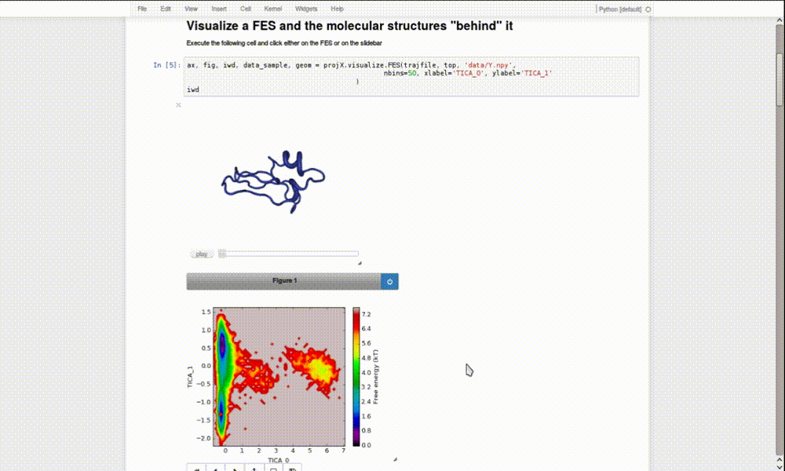

.. Projection Explorer documentation master file, created by
   sphinx-quickstart on Mon Feb 20 13:34:27 2017.
   You can adapt this file completely to your liking, but it should at least
   contain the root `toctree` directive.

Welcome to Projection Explorer's Documentation!
===============================================
Projection Explorer (projX) is a python module that provides **interactive visualization of projected coordinates
of molecular dynamics (MD) trajectories** inside an ipython notebook. 

Projection Explorer uses the incredibly useful  ``nglview`` `IPython/Jupyter <https://github.com/arose/nglview>`_ widget.
Other libraries heavily used are are `mdtraj <http://mdtraj.org/>`_ and `PyEMMA <http://www.emma-project.org/latest/>`_, a library into which projX will utimately be merged into.
At the moment, there is also an `sklearn <http://scikit-learn.org/stable/index.html>`_  dependency that might disappear in the future.

At the moment the API consists of two subpackages:

.. toctree::
   :maxdepth: 1

   index_visualize
   index_generate
   index_notebooks

.. contents:: 
   What you'll find on this page

Download and Install
=====================

At the moment, cloning or downloading the `source from github <https://github.com/gph82/projection_explorer>`_ is the only option to get projX.
After that, just cd to the directory ``projection explorer`` and issue

    >>> python setup.py install

QUICK START
=============

    >>> cd projX/notebooks
    >>> jupyter notebook Projection_Explorer.ipynb

should put you in front of an ipython notebook explaining the basic functionality.

DOCUMENTATION
==============
You can build html documentation by issuing

    >>> cd docs
    >>> make html 

This will generate ``projection_explorer/docs/build/html/index.html`` with the html
documentation.

WARNINGS:
=========

 * The important methods (bmutils) have been tested, the API  has only been tested superficially. Expect some instability.

 * This is currently under heavy development and the API might change rapidly.

KNOWN ISSUES:
=============
 * The installation of nglview might give a ``SandboxViolation`` error. Until this is fixed, the recommended install is
   to externally issue

    >>> conda install nglview -c bioconda

    or, alternatively

    >>> pip install nglview

 * Projection Explorer only works with ``nglview`` versions >=0.6.2.1. 

 * **The interplay between nglview, nbextensions, ipywidgets might limit you to use python3.X on some platforms.
   Sorry about that.**

Indices and tables
==================

* :ref:`genindex`
* :ref:`modindex`
* :ref:`search`

